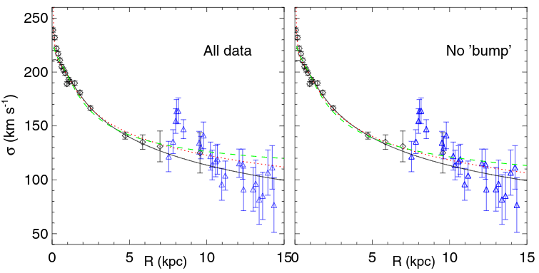
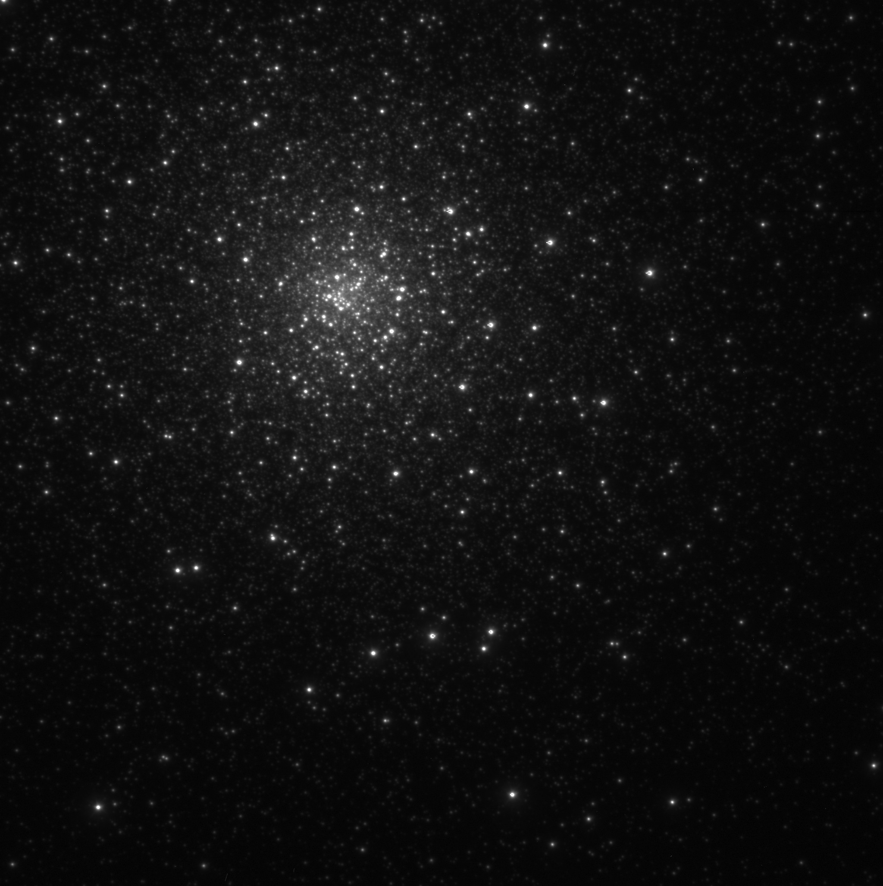
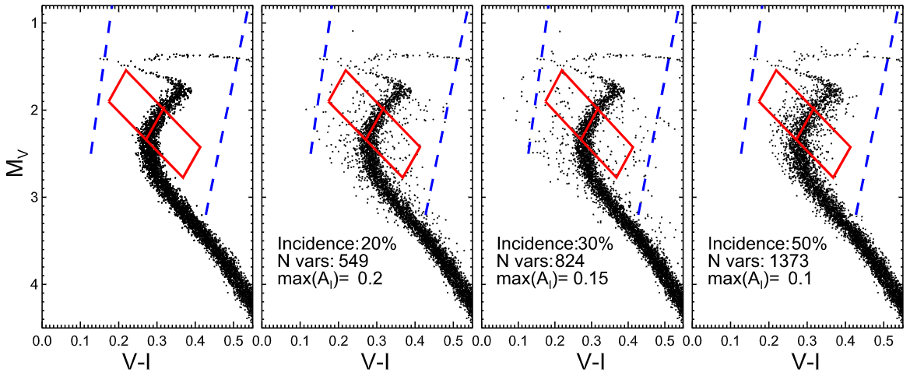

### Isolated elliptical galaxies as tests of galaxy formation ###

Clusters of galaxies are great because you can study several galaxies and their intereactions at the same time. Clusters of galaxies are also awful, because galaxy interactions and interactions with the intracluster medium will alter star formation rates, galaxy structure, and their dark matter content. In that sense isolated galaxies represent a simpler benchmark for galaxy formation theories. In particular, no dark matter stripping should occur, and the dark halos of isolated galaxies should be closer to the CDM predictions than any other galaxies. The opposite has been shown to be the case in NGC 7507 ([Salinas et al. 2012](https://ui.adsabs.harvard.edu/abs/2012A%26A...538A..87S/abstract) and [Lane, Salinas & Richtler 2015](https://ui.adsabs.harvard.edu/abs/2015A%26A...574A..93L/abstract)), and we continue with this work on similar galaxies.

*The velocity dipersion profile of NGC 7507. The solid black line indicates a model which does not require dark matter and provides the best description to the data*
### Maffei 1, our backyard elliptical ###

Maffei 1 is probably the closest elliptical galaxy to the Milky Way, but its unfortunate position, only 0.5 degress above the Galactic plane, have made its study very difficult. Using wide-field multicolor Subaru/Suprime-Cam imaging of this galaxy we are currently studying its globular cluster system for the first time.

*Maffei 1 as seen by Suprime-Cam. Due to the high extinction, only the center of the galaxy is clearly visible, but its globular cluster extends even beoyond the Suprime-Cam field-of-view*

### Stellar variability in globular clusters

I have been working in and out on stellar variability in globular clusters since my undergrad thesis ([Salinas et al. 2005](https://ui.adsabs.harvard.edu/abs/2005IBVS.5640....1S/abstract),[2007](https://ui.adsabs.harvard.edu/abs/2007IBVS.5744....1S/abstract)), working towards a complete census of variable stars in these crowded environments *via* image subtraction ([Salinas et al. 2019](https://ui.adsabs.harvard.edu/abs/2019AJ....157...47S/abstract)), with an special interest in the use of ground layer adaptive optics to pierce deeper into the dense centers of globular clusters ([Salinas et al. 2016](https://ui.adsabs.harvard.edu/abs/2016AJ....152...55S/abstract)). Future work in this area includes a survey for short period variability in about 10 Galactic clusters using [NOT](http://www.not.iac.es/) and [SOAR](http://www.ctio.noao.edu/soar/) data.

*The Galactic globular cluster M80 imaged with the SOAR Adaptive optics Module (SAM), for a image quality of 0.35 arcseconds*

### Stellar variability masquerading as multiple stellar populations?

Intermediate-age clusters in the Magellanic Clouds present extended main sequence turnoffs that can be explained either as an extended star formation or as an effect of stellar rotation. In [Salinas et al. 2016b](https://ui.adsabs.harvard.edu/abs/2016ApJ...832L..14S/abstract) we propose that the extended TOs may be instead produced by Delta Scuti variables not properly assessed in *HST* photometry, theory we subsequently tested in the LMC cluster NGC 1846 ([Salinas et al. 2018](https://ui.adsabs.harvard.edu/abs/2018AJ....155..183S/abstract)).

*A simulation from Salinas et al. (2016) showing how an increased number of delta scuti produces a wider main sequence turnoff*

### A new short-period variability survey in the Magellanic Clouds ###

The results of Salinas et al. (2018) showed how incomplete our knowledge of short period pulsators in the LMC is. Tens of thousands of these variables have been missed by both OGLE and SuperMACHO. To update the knowledge ofWe have started a new survey using the largest imager in the world, DECam.
